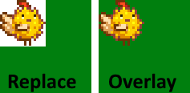

← [模组作者指南](../author-guide.md)

带有 **`"Action": "EditImage"`** 的补丁可以更改游戏已加载的图像的一部分。多个内容包可以编辑同一素材。您可以使用补丁向下延伸图像（Content Patcher 会自动扩大图像以适应新图像）。

**🌐 其他语言：[en (English)](../../author-guide/action-editimage.md)。**

## 目录<a name="contents"></a>
* [用法](#usage)
  * [格式](#format)
  * [示例](#examples)
* [参见](#see-also)

## 用法<a name="usage"></a>
### 格式<a name="format"></a>

一个 `EditImage` 补丁由 `Changes`（请参阅下文[示例](#examples)）下的一个模型组成，包含以下字段。

<dl>
<dt>必填字段：</dt>
<dd>

字段       | 用途
--------- | -------
`Action`  | 要进行的更改类型。此操作类型设置为 `EditImage`。
`Target`  | 要修改的目标[游戏素材名称](../author-guide.md#what-is-an-asset)（或多个由逗号分隔的素材名），例如 `Portraits/Abigail`。该字段支持[令牌](../author-guide.md#tokens)，不区分大小写。
`FromFile` | 内容包文件夹中用于修补到目标中的文件的相对路径（例如 `assets/dinosaur.png`），或多个逗号分隔的路径。这可以是 `.png` 或 `.xnb` 文件。该字段支持[令牌](../author-guide.md#tokens)，不区分大小写。

</dd>
<dt>可选字段：</dt>
<dd>

字段         | 用途
----------- | -------
`FromArea`  | <p>源图片中需要复制到目标图片的部分，默认为整个源图片。</p><p>此字段是一个对象，含有左上角点的 X 和 Y 像素坐标以及该区域的像素宽度（Width）和高度（Height）。该对象的字段支持[令牌](../author-guide.md#tokens)。</p>
`ToArea`    | <p>目标图片中要修改的部分。默认大小与 `FromArea` 相同，锚点位于贴图的左上角。</p><p>此字段是一个对象，含有左上角点的 X 和 Y 像素坐标以及该区域的像素宽度（Width）和高度（Height）。该对象的字段支持[令牌](../author-guide.md#tokens)。</p><p>如果您指定的区域超出了图像的底部，Content Patcher 会自动扩大图像以适应新图像。</p>
`PatchMode` | <p>如何将 `FromArea` 应用到 `ToArea`。默认为 `Replace`。</p> 可使用的值: <ul><li><code>Replace</code>：用源图像修改目标区域中的每个像素。如果源图像有透明像素，则目标图像将在这些位置变为透明。</li><li><code>Overlay</code>：在目标区域上绘制源图像。如果源图像有透明或半透明像素，则目标图像将“透过”这些像素；不透明像素将修改目标像素。</li></ul>例如，假设您的源图像是具有透明背景的河豚鸡，而目标图像是实心绿色正方形。 以下是它们在不同 `PatchMode` 下的组合：<br />
`When`        | （可选）仅在给定的[条件](../author-guide.md#conditions)匹配时应用这个内容补丁。
`LogName`     | （可选）在日志中显示的补丁名称。这有助于查找错误。如果省略，则默认为类似 `EditImage Animals/Dinosaur` 的名字。
`Update`      | （可选）补丁字段的更新频率。请参阅[补丁更新频率](../author-guide.md#update-rate)。
`LocalTokens` | （可选）一组仅在此补丁中生效的[局部令牌](../author-guide/tokens.md#local-tokens)。

</dd>
<dt>进阶字段：</dt>
<dd>

<table>
  <tr>
    <td>字段</td>
    <td>用途</td>
  </tr>
  <tr>
  <td><code>Priority</code></td>
  <td>

（可选）当多个补丁编辑同一数据素材时，此字段控制它们应用的顺序。可用的值有 `Early`（更早），`Default`（默认），还有 `Late`（更晚）。默认值为 `Default`。

补丁（包括所有模组）按以下顺序生效：

1. 优先级从早到晚；
2. 按照模组加载顺序（基于依赖关系等因素）；
3. 按照补丁在 `content.json` 中列出的顺序。

如果需要更具体的顺序，可以使用简单的偏移量，如 `"Default + 2"` 或者 `"Late - 10"`。默认值为 -1000（`Early`），0（`Default`）和 1000（`Late`）。

此字段**不支持**令牌，不区分大小写。

> [!TIP]
> 优先级会让您的更改难以排除故障。推荐做法：
> * 如果可以的话，只使用上述无偏移的优先级（例如外观覆盖设为 `Late`）
> * 不需要为您自己的补丁设置优先级，因为您可以自己在 content.json 排列好补丁应用的顺序。

  </tr>
  <tr>
  <td><code>TargetLocale</code></td>
  <td>

（可选）素材名称中要匹配的地区代码，例如设置 `"TargetLocale": "fr-FR"` 将会只编辑法语的素材（例如 `Animals/Dinosaur.fr-FR`）。可以为空，只有只编辑没有地域区分的基本素材。

如果省略，则将应用于所有素材，不论其是否存在本地化。

</td>
</table>
</dd>
</dl>

### 示例<a name="examples"></a>

这个示例改变某一物品的图标：
```js
{
   "Format": "2.7.0",
   "Changes": [
      {
         "Action": "EditImage",
         "Target": "Maps/springobjects",
         "FromFile": "assets/fish-object.png",
         "FromArea": { "X": 0, "Y": 0, "Width": 16, "Height": 16 }, // 可选，默认整个图片
         "ToArea": { "X": 256, "Y": 96, "Width": 16, "Height": 16 } // 可选，默认与 FromArea 大小相同
      },
   ]
}
```

## 参见<a name="see-also"></a>
* 其他操作和选项请参见[模组作者指南](../author-guide.md)。
