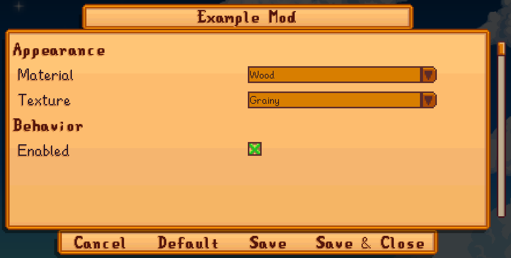
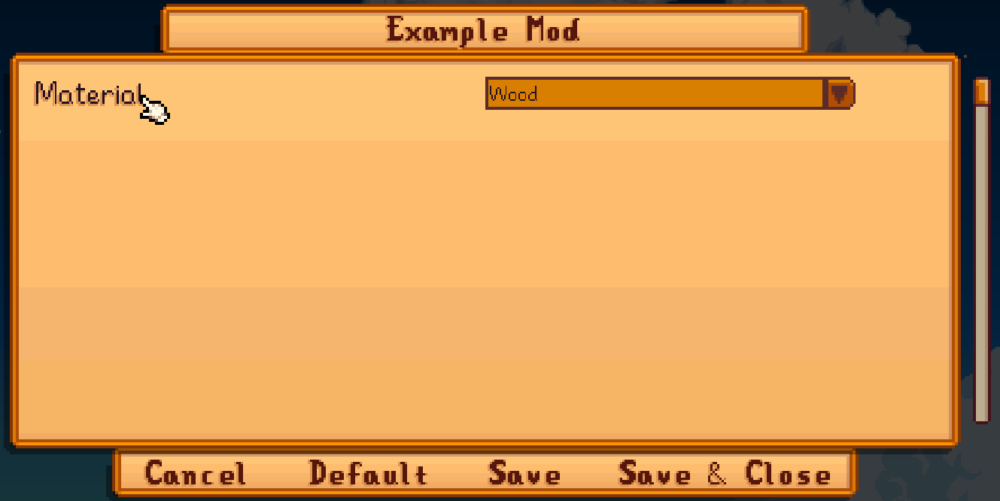
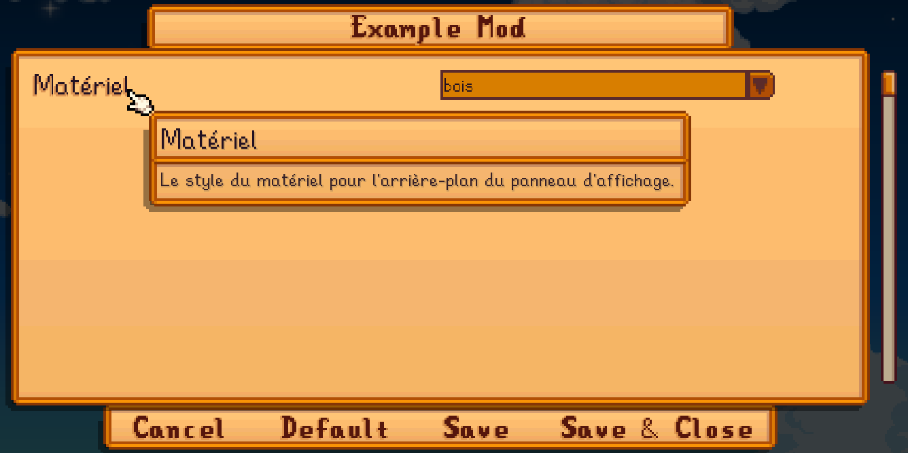

← [模组作者指南](../author-guide.md)

配置选项功能让您向玩家提供可更改的配置，并基于配置在内容包中实现动态更改。

**🌐 其他语言：[en (English)](../../author-guide/config.md)。**

## 目录
* [基本配置](#basic-config)
  * [概述](#overview)
  * [定义您的配置](#define-your-config)
  * [示例](#examples)
* [配置菜单](#config-ui)
  * [显示选项](#display-options)
  * [分段](#sections)
  * [翻译](#translations)
* [参见](#see-also)

## 基本配置<a name="basic-config"></a>
## 概述<a name="overview"></a>

您可以使用 `ConfigSchema` 字段定义内容包的配置选项。Content Patcher 将自动添加 `config.json` 文件和[游戏内配置菜单](#config-ui)并允许玩家更改您提供的配置。

在内容包内您可以把配置选项当作[令牌和条件](../author-guide.md#tokens)使用，从而实现动态改变。

### 定义您的配置<a name="define-your-config"></a>

首先，您需要为 Content Patcher 描述配置选项。添加一个 `ConfigSchema` 字段来描述您的内容包所提供的选项（该字段与 `Changes` 同级，因此应当将其放在包含补丁的 `Changes` 字段外）。每一个配置选项均包含一个作为令牌的键，以及含有以下字段的模型：

类型             | 作用
----------------| -------
`AllowValues`   | （可选）一个以逗号分隔的字符串，代表玩家可选的值。如果省略，则允许任何值。<br />**提示:** 当您用`"true, false"`定义可启用/禁用的选项时，Content Patcher 将其识别为 `bool` 值（同时在[配置菜单](#config-ui)中以复选框形式显示此配置项）。
`AllowBlank`    | （可选）该字段是否可以留空。如果值为空或 false，则将用默认值 `Default` 替换空字段。
`AllowMultiple` | （可选）玩家是否可以指定多个以逗号分隔的值。默认为 false。
`Default`       | （可选，除非 `AllowBlank` 为 false）此配置项的默认值。如果 `AllowMultiple` 为 true，则可以包含多个以逗号分隔的值。如果省略，默认值为空。

配置选项的名称和字段不区分大小写。

### 示例<a name="examples"></a>

此 `content.json` 定义了一个名为 `BillboardMaterial` 的配置，并使用此配置令牌控制补丁效果。

```js
{
   "Format": "2.7.0",
   "ConfigSchema": {
      "Material": {
         "AllowValues": "Wood, Metal",
         "Default": "Wood"
      }
   },
   "Changes": [
      // 作为令牌
      {
         "Action": "Load",
         "Target": "LooseSprites/Billboard",
         "FromFile": "assets/material_{{Material}}.png"
      },

      // 作为条件
      {
         "Action": "Load",
         "Target": "LooseSprites/Billboard",
         "FromFile": "assets/material_wood.png",
         "When": {
            "Material": "Wood"
         }
      }
   ]
}
```

当您运行游戏时，Content Patcher 会自动生成一个 `config.json` 文件：

```js
{
  "Material": "Wood"
}
```

玩家可以编辑此 `config.json` 文件来改变配置，或使用游戏内[配置菜单](#config-ui)。

## 配置菜单<a name="config-ui"></a>
当您的内容包有配置选项时，Content Patcher 会为您的内容包自动添加一个游戏内的配置菜单（需要配合 [Generic Mod Config Menu](https://www.nexusmods.com/stardewvalley/mods/5098)）。您可以为此配置菜单提供一些可选的字段来进一步优化它。

### 显示选项<a name="display-options"></a>
现有两个控制配置菜单的字段：

类型           | 作用
------------- | -------
`Description` | （可选）配置选项的说明，在配置菜单界面中显示为提示信息。
`Section`     | （可选）一个分段的标题。 请参阅下文[分段](#sections)章节。

### 分段<a name="sections"></a>

您可以用 `Section` 字段为您的配置选项分组。未被分组的选项会先显示，其余项则根据它们在 `ConfigSchema` 中出现的顺序依次列出。

例如，这些选项分到两个分段下：

```js
{
    "Format": "2.7.0",
    "ConfigSchema": {
        // 外观分段
        "Material": {
            "AllowValues": "Wood, Metal",
            "Default": "Wood",
            "Section": "Appearance"
        },
        "Texture": {
            "AllowValues": "Grainy, Smooth",
            "Default": "Grainy",
            "Section": "Appearance"
        },

        // 行为分段
        "Enabled": {
            "AllowValues": "true, false",
            "Default": "true",
            "Section": "Behavior"
        }
    },
    "Changes": [ ]
}
```

游戏内显示如下：



### 翻译<a name="translations"></a>
默认情况下，配置选项会直接显示在配置界面中，没有显示名称、提示信息或翻译：



您可以为配置添加[翻译文件](https://zh.stardewvalleywiki.com/模组:翻译模组)，从而提高界面的可读性与易用性。当您创建一个 `i18n/default.json` 后，您可以按照以下格式为您的字段添加翻译键：

键格式                             | 描述
:------------------------------------- | :----------
`config.<name>.name`                   | 配置选项名。
`config.<name>.description`            | 配置选项描述，一般在提示信息中显示。
`config.<name>.values.<value>`         | 在下拉列表或复选框中显示的 `AllowValues` 值。
`config.section.<section>.name`        | [分段](#sections)名称。
`config.section.<section>.description` | [分段](#sections)描述，一般在提示信息中显示。

所有翻译键都是可选的，不区分大小写。

这个示例为以上的配置添加法语翻译：

```js
// i18n/default.json（默认语言，英文）
{
    "config.Material.name": "Material",         // 为名为“Material”的选项添加翻译键
    "config.Material.description": "The material style for the billboard background.",  // 为“Material”的选项添加提示信息
    "config.Material.values.Wood": "wood",      // 为可选值“Wood”添加翻译键
    "config.Material.values.Metal": "metal"     // 为可选值“Metal”添加翻译键
}

// i18n/fr.json（法语）
{
    "config.Material.name": "Matériel",
    "config.Material.description": "Le style du matériel pour l'arrière-plan du panneau d'affichage.",
    "config.Material.values.Wood": "bois",
    "config.Material.values.Metal": "métal"
}
```

添加后法语玩家会看到以下界面：



请参阅 Wiki 上的[翻译模组](https://zh.stardewvalleywiki.com/模组:翻译模组)。

## 参见<a name="see-also"></a>
* 其他操作和选项请参见[模组作者指南](../author-guide.md)。
