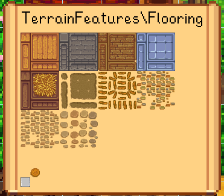

← [模组作者指南](../author-guide.md)

此文档介绍各种能帮助您排查内容包问题的工具。

**🌐 其他语言：[en (English)](../../author-guide/troubleshooting.md)。**

## 目录
* [JSON 模式验证](#schema-validator)
* [补丁(patch)命令](#patch-commands)
  * [`summary`](#summary)
  * [`update`](#update)
  * [`reload`](#reload)
  * [`export`](#export)
  * [`parse`](#parse)
  * [`dump`](#dump)
  * [`invalidate`](#invalidate)
* [调试模式](#debug-mode)
* [详细日志](#verbose-log)
* [参见](#see-also)

## JSON 模式验证<a name="schema-validator"></a>
您可以验证您的 `content.json` 和 `manifest.json` 以检测一些常见问题。（尽管如此，您仍应当在发布前手动在游戏内测试您的内容包，因为这些验证不能发现所有问题）

在网页上验证 JSON：
1. 前往 [smapi.io/json](https://smapi.io/json)（国内环境需要借助其它手段）；
2. 将 format（格式）设为“Manifest”（用于检测 `manifest.json`）或“Content Patcher”（用于检测 `content.json`）；
3. 将 JSON 文件拖放到文本框里，或将其粘贴到文本框里。
4. 点击“save & validate file”查看验证结果。您可以选择分享 URL 以让他人查看该结果。

您可以在支持 JSON 模式的文本编辑软件自动验证您的 JSON 格式，请参阅网页 JSON 验证器的文档：
[直接使用 JSON 模式文件](https://github.com/Pathoschild/SMAPI/blob/develop/docs/technical/web.md#using-a-schema-file-directly)。

<!-- Following content adapted from SMAPI docs 'Using a schema file directly' -->
---
以下内容改编自文档：[直接使用JSON模式文件](https://github.com/Pathoschild/SMAPI/blob/develop/docs/technical/web.md#using-a-schema-file-directly)。

您可以在支持 JSON 模式的文本编辑软件里直接使用 SMAPI 提供的 JSON 模式，例如：
```js
{
   "$schema": "https://smapi.io/schemas/manifest.json",
   "Name": "Some mod",
   ...
}
```
可的 JSON 模式包括：

格式 | JSON 模式 URL
------ | ----------
[SMAPI: `manifest.json`](https://zh.stardewvalleywiki.com/模组:制作指南/APIs/Manifest) | https://smapi.io/schemas/manifest.json
[SMAPI: 翻译（`i18n` 文件夹）](https://zh.stardewvalleywiki.com/模组:制作指南/APIs/Translation) | https://smapi.io/schemas/i18n.json
[Content Patcher: `content.json`](../README.md) | https://smapi.io/schemas/content-patcher.json

---
<!-- Above content adapted from SMAPI docs 'Using a schema file directly' -->

提示
* 每次更新模组时，您应该将您内容包格式更新到最新版本，以方便未来兼容；
* 如果您的内容包有 `Unexpected character` 的报错，这意味您的 JSON 语法有误。请尝试检查报错信息提到的行（或之前一行）内是否缺少逗号、括号，或使用了中文全角标点符号；
* 如果您需要帮助，请查看[主 README 中的“参见”章节](../README.md#see-also)所提供的连接。

## 补丁（patch）命令<a name="patch-commands"></a>
Content Patcher 提供了一系列用于测试和故障排除的控制台命令。在 SMAPI 控制台里输入`patch help` 可查看帮助文档。

> 注：这些控制台命令反馈的信息均为英文，此文档会注释示例中的词汇意义，但实际使用时不会显示。

### `summary`

`patch summary` 提供内容包的全面概述，这包括：

* 全局令牌值；
* 每个内容包的专属令牌值；
* 每个内容包的 `CustomLocations`；
* 以及每个包加载的补丁及其当前值，它们所做的更改，以及未生效的原因（如果其未生效）。

例如：

```
=====================
==  Global tokens （全局令牌）  ==
=====================
   Content Patcher:

      token name（令牌名）| value （值）
      ---------------- | -----
      Day              | [X] 5
      DayEvent         | [X]
      DayOfWeek        | [X] Friday
      DaysPlayed       | [X] 305
      FarmCave         | [X] Mushrooms
      FarmhouseUpgrade | [X] 1
      FarmName         | [X] River Coop
      FarmType         | [X] Riverland

      [省略]

=====================
== Content 补丁 ==
=====================
The following patches were loaded. For each patch:
以下补丁已加载，每一个补丁会显示：
  - 'loaded' shows whether the patch is loaded and enabled (see details for the reason if not).
  - 'loaded' 显示补丁是否生效（若未生效请查看详细原因）
  - 'conditions' shows whether the patch matches with the current conditions (see details for the reason if not). If this is unexpectedly false, check (a) the conditions above and (b) your Where field.
  - 'conditions' 显示补丁是否符合当下条件（若不符合请查看详细原因）。如果这意外为“否”请检查(a)以上条件(b)您的Where字段
  - 'applied' shows whether the target asset was loaded and patched. If you expected it to be loaded by this point but it's false, double-check (a) that the game has actually loaded the asset yet, and (b) your Targets field is correct.
  - 'applied' 显示目标素材有没有被加载并修改，如果您认为素材应该已经被加载了但在这里显示为否，请检查游戏是否真的加载了此素材，和您的Target字段是否正确。


Example Content Pack:
------------------------------

   Local tokens（专属令牌）:
      token name（令牌名）| value （值）
      ----------------- | -----
      WeatherVariant    | [X] Wet

   Patches （补丁）:
      loaded  | conditions | applied | name + details
      ------- | ---------- | ------- | --------------
      [X]     | [ ]        | [ ]     | Dry Palm Trees // conditions don't match: WeatherVariant
      [X]     | [X]        | [X]     | Wet Palm Trees

   Current changes（现有更改）:
      asset name （素材名）       | changes（现有更改）
      ------------------------- | -------
      TerrainFeatures/tree_palm | edited image
```

您可以按任意顺序指定这些参数（如 `patch summary "LemonEx.HobbitHouse" "Another.Content.Pack" full`）：

参数              | 效果
:--------------- | :-----
`"<内容包 ID>"`   | 一个或多个要显示数据的内容包 ID。如果省略，则显示所有内容包。
`asset "<素材>"`  | 只显示对应某素材的更改。这通过基础素材名称过滤，所以 `Data/furniture` 也会显示针对 `Data/furniture.fr-FR` 的素材名。您可以通过重复该标识来列出多个素材（例如：`asset Data/Crops asset Data/Objects`）。
`full`           | 不截断很长的令牌值。
`unsorted`       | 不对值进行排序以显示。这主要用于检查 `valueAt` 的实际顺序。

### `update`
`patch update` 会立即更新 Content Patcher 的条件上下文并重新检查所有补丁。 当您更改某些条件时（如更改日期）后，您可以使用这个命令在不睡觉的情况下更新补丁。

### `reload`
`patch reload` 会重新加载特定内容包添加的补丁。这使您可以在游戏运行时更改内容包的 JSON 文件，并在不重启游戏的情况下看到更改。非补丁内容不会被重新加载，例如设置菜单和动态令牌。

例如：

```
> patch reload "LemonEx.HobbitHouse"
Content pack reloaded.
```

对于使用 [Include 补丁](action-include.md)的内容包，您可以通过传递文件的相对路径作为第二个参数来选择性地仅重新加载由特定 Include 补丁添加的补丁。

例如：

```
> patch reload "LemonEx.HobbitHouse" "assets/some-include.json"
Content pack reloaded.
```

### `export`

`patch export` 将某一素材的副本保存到您的游戏文件夹里，您可以通过这个功能查看素材在补丁生效后的状态。此功能适用于图像、数据和地图类型的素材。

例如：

```
> patch export "Maps/springobjects"
Exported asset 'Maps/springobjects' to 'C:\Program Files (x86)\Steam\steamapps\common\Stardew Valley\patch export\Maps_springobjects.png'.
```

### `parse`
`patch parse` 使用当前 Content Patcher 上下文（与应用补丁时使用的相同值）解析含有令牌的字符串，并显示生成的元数据。

默认情况下识别全局令牌。您可以通过提供来自 `manifest.json` 的内容包 ID 作为可选的第二个参数，来使用专属令牌值（包括动态令牌和配置选项值）。

例如：

```
> patch parse "assets/{{Variant}}.{{Language}}.png" "Pathoschild.ExampleContentPack"

Metadata （元数据）
----------------
   raw value（原始值）:   assets/{{Variant}}.{{Language}}.png
   ready（可用）:       True
   mutable（可变）:     True
   has tokens（包含令牌）:  True
   tokens used（令牌）: Language, Variant

Diagnostic state（诊断状态）
----------------
   valid（有效的）:    True
   in scope（范围内）: True
   ready（可用）:    True

Result （结果）
----------------
   The token string is valid and ready. Parsed value: "assets/wood.en.png"
   令牌字符串有效且可用，解析为: "assets/wood.en.png"
```

这也可以用来排查令牌的语法是否存在错误：

```
> patch parse "assets/{{Season}.png"
[ERROR] Can't parse that token value: Reached end of input, expected end of token ('}}').
```

### `dump`
`patch dump` 提供 Content Patcher 的内部状态报告。这主要用于排查技术问题，大多数情况下使用 `patch summary` 更方便。

可使用的报告有：

* `patch dump order` 显示所有补丁的定义顺序。
* `patch dump applied` 显示所有补丁，以目标分类，并显示补丁是否已生效。

### `invalidate`
`patch invalidate` 立即将某个素材从游戏/SMAPI 缓存中移除。如果这个素材是由 SMAPI 管理，那它会立即被重加载，Content Patcher 将重新应用其更改。若不由 SMAPI 管理，那么加载相同素材的代码将会在下一次请求加载时获得新实例。

例如：

```
> patch invalidate "Buildings/houses"

[Content Patcher] Requested cache invalidation for 'Portraits\Abigail'.
[SMAPI]           Invalidated 1 asset names (Portraits\Abigail).
[SMAPI]           Propagated 1 core assets (Portraits\Abigail).
[Content Patcher] Invalidated asset 'Portraits/Abigail'.
```

## 调试模式<a name="debug-mode"></a>
Content Patcher 自带一个“调试模式”，允许您在游戏内直接查看带有所有当前更改的纹理。您可以将 `config.json` 中的 `EnableDebugFeatures` 设为 `true` 来启用此功能。

启用后，即可按 `F3` 显示纹理，使用左右 `ctrl` 循环查看图像，关闭并重新打开调试 UI 以刷新纹理列表。

> 

## 详细日志<a name="verbose-log"></a>
Content Patcher 不记录太多日志内容。您可以在 `smapi-internal/StardewModdingAPI.config.json` 中启用 `VerboseLogging` 来获得更详细的日志。
**这可能会显著减慢游戏加载速度，若非必要不建议启用。**

启用后，日志会在以下三个节点显示更多内容：
1. 加载补丁时（例如每个补丁是否已启用，以及哪些文件已预加载）；
2. 当 SMAPI 检查 Content Patcher 是否可以加载/编辑资产时；
3. 当上下文变更时（任何可能影响条件的改变：不同日期、季节、天气等）。

如果您的补丁更改没有出现在游戏中，请确保设置了 `LogName` 字段（请参阅[操作](../author-guide.md#actions)）然后在日志里搜索您设置的 `LogName`。请注意以下细节：
* Content Patcher 是否已加载了补丁？
  如果没有出现在日志里，检查您的 `content.json` 是否有效。如果日志里显示“skipped”，检查您的 `Enabled` 值或 `config.json`。
* 当上下文更新时，补丁名称旁边的复选框是否被勾选？
  如果没有，检查您的 `When` 字段。
* 当 SMAPI 检查其是否可以 Load/Edit 内容时，旁边的复选框是否被勾选？
  如果没有，检查您的 `When` 和 `Target` 字段。

## 参见<a name="see-also"></a>
* 其他操作和选项请参见[模组作者指南](../author-guide.md)。
